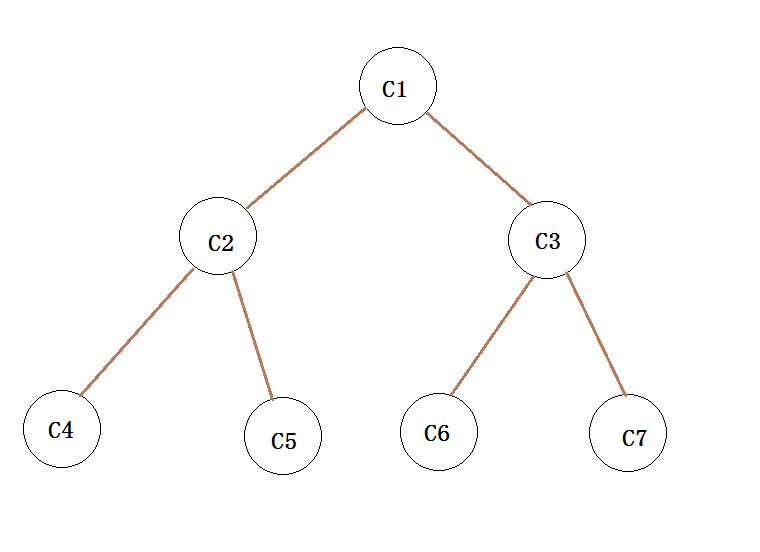
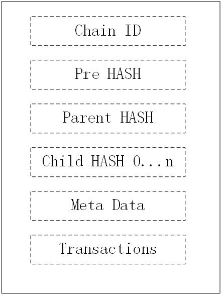
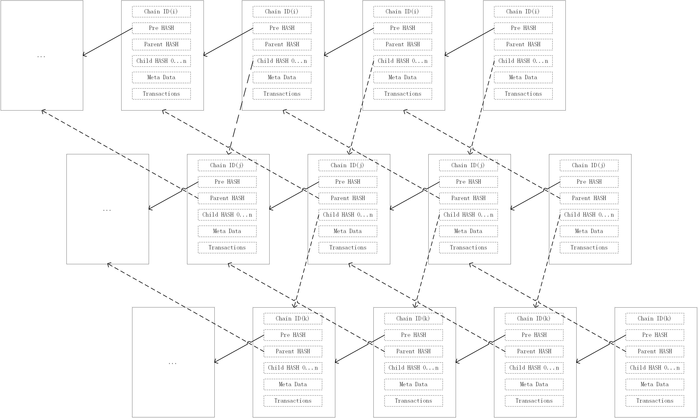

# GOVM白皮书

## 摘要

    区块链已经发展了很长时间，但技术依旧处在探索阶段。
    作为鼻祖，比特币稳定、可信，但其仅仅是账本，性能、智能还远远无法满足大规模商用。
    作为第二代区块链的代表，以太坊推出了智能合约，同时提高了处理能力和智能性，但它的性能也还远远无法满足大规模商用。
    现在需要一种高性能的区块链系统。
    GOVM区块链就是一个高性能的公链。以信息共享为目标。

## 目录

1. [历史](#历史)
1. [理论](#理论)
1. [挖矿奖励](#挖矿奖励)
1. [数据](#数据)
1. [账户](#账户)
1. [区块](#区块)
1. [交易](#交易)
1. [程序](#程序)
1. [关键字](#关键字)

## 历史

比特币仅仅是一个区块链账本，在简单的共识算法上，系统简单、稳定、可靠。但它的代价是高能耗、低性能、不智能。

以太坊的出现，解决了智能问题，它支持编程，性能有所提升，可是依旧不够。

EOS虽然性能进一步提升，但它需要超级节点，过度集中，为了性能，牺牲分布式，这是一种妥协。优劣还需要时间的考验

闪电网络需要两种区块链之间的矿工支持，相当于对共识算法的扩展，推广难度大，同时降低了单条区块链的可信度

分片技术，能一定程度上提高性能，但主链还是会成为性能瓶颈

## 理论

### 高性能

单条链的数据处理相当于单线程，即使再快也满足不了全球的超高并发量。

    现有区块链虽然数据的维护由分布式系统组成，但还是没有改变数据处理的单线程问题。
    为了提高性能，就需要将数据处理变成多线程的，就是相当于数据处理分布式。
    整个系统就是分布式基础网络+分布式数据处理，双层分布式，解决数据处理的性能问题。

多链可以解决这种问题。如果是不同的区块链，想要跨系统交互，就需要对原有的共识算法扩展，以满足跨链交易。
这种做法降低了区块链可靠性，同时增加了系统的复杂性

如果一个系统就是多链的，就可以实现并发操作了。单条链，只是数据的分发是分布式的，数据的处理还是串行的。
多条链，就能做的数据的分发和处理都是分布式的。

本系统就是一种多链的区块链系统。
定义了新链创建的共识算法，链与链信息交互的共识算法，同时将golang开发语言集成进系统，支持编程，在区块链上运行app。

子链可以由父链根据共识进行创建（当父链处理能力不足时，根据共识创建）

二叉树的深度为64层，所以链的总数可以达到2^64-1(链的序号从1开始)

若每条链的block大小为1M，每分钟一个包，那么系统最大的处理能力为每分钟(2^64 -1)*1M

链的区块间隔可以动态调整，区块大小也可以动态调整；子链的区块间隔比父链的更小，出块速度更高

系统初始只有一条链，即二叉树的根节点。随着时间的推移，根据需要慢慢扩展，不断提升性能。

链与链之间的逻辑关系如下：

区块的结构：

区块链：

由上图可知，父子链中的区块有相对依赖，这样能够保证数据的可追溯性和不可修改性。

### 共识

1. 本系统的机制是注册制+POW。
2. 任何人都可以花费虚拟货币，注册成为某一个区块的矿工，注册过的矿工，计算算力时，有相应加分。
3. 矿工如果不生成区块，他将得不到奖励，注册押金依旧需要冻结
4. 一个区块可以有多名注册矿工，按照注册的押金多少分优先级，优先级越高，算力加分越多。
5. 非注册的矿工，没有算力加成，一样允许挖矿，只是需要付出更多的算力。
6. 押金会被冻结，退还时间为区块序号+50000。
7. 不同的链是相对独立的，所以链越多，则越加的去中心化。
8. 挖矿收益将逐年递减。
9. 区块需要签名，先签名，后计算HASH，这样能够避免公共矿场的存在，除非你不怕私钥泄露。
10. 由于是使用注册制、冻结资金的方式，注册过的矿工有更高优先级，可以避免算力恶意在不同链之间挖矿，破坏去中心化。
11. 链的数量越多，51%攻击需要的算力占比越小，越容易被恶意攻击。矿工注册制可以一定程度上减小51%攻击可能性。
12. 大部分共识都是写在第一个app中的，能够保证共识的长期稳定。同时预留了扩展接口，有新的需求方便扩展。
13. 系统初始时，虚拟货币很少，无法支撑注册制的所需要的押金，所以只是POW机制起作用

### 去中心化

1. 区块必须要签名，可以避免算力集中(矿池)的问题，如果使用矿池，将导致私钥泄露。
2. POW和注册制共同作用。
3. 注册过的矿工有更高的优先级，计算其算力，有加分。
4. 注册资金冻结，冻结时间超过50000个区块，避免“富翁”完全垄断。
5. 链的数量越多，矿工越分散，更加去中心化

### 可编程

1. 支持发布app(golang的源码)，其他人可以调用调用该app。
2. 使用golang的原因：强类型判断，高效，简洁，通用，能够使用更少的代码实现相同功能。
3. 系统的核心共识算法是以app的形式发布，一经发布，不允许再改动，这样能够保证有一个稳定的共识。
4. 发布的是源码，任何人都可以看到，了解其逻辑，信任其流程。

## 安全性

1. 因为平台主要是用于信息共享，所以历史信息都是有价值的，那么用户就不合适频繁更换钱包地址
2. 为了解决账户的过度签名导致私钥泄露的风险，系统支持代理签名的功能
3. 代理签名是一种双层签名机制，地址A（地址前缀为2）指定地址B作为自己的代理人，可以替A签名。消息签名中将包含A对B的授权签名和B对消息的签名。
4. 用户是转账、跨链转账或执行app，都需要指定具体的操作码，保证操作的确定性
5. app发布的是golang的源代码，任何人都可以比较容易的看懂代码逻辑。app在创建时，所有代码逻辑就确定了，不会造成歧义。
6. app没有操作用户账户的权限，除非用户发布的是私有app，才允许操作对应用户的账户
7. app只能修改自己的存储数据，除非依赖的模块特意开放了对应的操作接口

## 挖矿奖励

1. 首条链单位时间(1分钟)的奖励为5000.000000000
2. 子链的奖励是父链的90%
3. 奖励每500000个区块减少10%
4. 系统没有ICO，没有预分配虚拟货币
5. 只有分配一个区块奖励用于创建第一个app（大部分共识都在该app中）
6. 为避免新链创建时，陷入恶意竞争，默认创建新链的人自动成为注册矿工（创建新链需要花费虚拟货币）
7. 每次挖矿奖励，都会给本软件的开发者1%的奖励，作为软件开发和维护费用
8. 每个交易都需要手续费，手续费50%给当前的矿工，50%放到公共账户里，分发给后续的矿工

## 数据

1. 默认支持KEY-VALUE的数据库
2. 数据类型分为2种：DB和Log
3. DB数据只能用于当前链进行读写
4. Log数据由当前链进行写入，不允许覆盖写，支持跨链读取
5. 创建简单，调用基础app的GetDb和GetLog就可以创建数据库
6. 直接调用Get和Set就可以实现数据的读写
7. 权限控制：每个数据库都只允许app自己操作，除非自己对外提供接口
8. 数据有存储时效，过期的数据将被清除（存储空间有限，需求无限，通过费用限制无用数据）
9. 数据的存储时长由app决定

## 账户

1. 系统使用账户模式，而非UTXO，这样可以减小交易大小
2. 普通账户就是一个公钥地址，可以自己离线创建;公共账户是创建公共app时系统自动创建的账户
3. 普通钱包地址为0x01*，代理签名的钱包地址为0x02*，公共app的账户地址为0xff*，其他的暂时保留，不支持多签名地址
4. 用户可以任意操作普通账户，但无法直接操作公共账户，只能通过app的代码规则进行操作
5. 用户私有的app允许操作用户的账户进行转出操作
6. 建议用户长期使用一个账户，区块链能提供的仅仅是基础信任，更多的信任需要靠过往的交易提升
7. 没有历史交易的账户，仅仅是无根之萍，没有可信度
8. 为支持代理签名，本系统的钱包地址和其他的区块链地址不一样，长度为24

## 区块

1. 该系统的区块头比其他系统的区块大，增加了签名、父链与子链中的区块hash。
2. 系统根据共识算法，支持父子区块链进行信息同步。
3. 通过父链或子链的区块hash，可以做到数据的可追溯性（跨链转账、跨链读取数据可追溯）

## 交易

1. 每笔交易都有时间戳，只有指定时间内的交易才会被接受
2. 每笔交易只要余额足够，都可以被接受，无顺序限制，降低双花操作的可能性。
3. 所有的交易都是由用户创建的，所有的app都是由用户调用，执行的代码明确无疑义
4. 交易分为多种类型：转账、跨链资金转移、创建app、执行app、注册矿工、创建子链等

## 程序

1. 每个人都可以发布app
2. app的名字就是源码的hash值
3. app要求是golang编写的源码
4. app只能import链上的其他app
5. app允许只属于个人，也支持属于公众的
6. 公众的app不属于个人，任何人都可以使用相同的代码发布相同app
7. 个人的app与账户绑定，其他人即使用相同的代码发布，最终的app name也会不一样
8. 每个app都有钱包账户，私人app的账户和私人账户一致;公众app的账户为公共账户，每个公众app都有专属的公共账户
9. app可以操作自己的账户进行转出，无法操作其他人的账户进行操作
10. 任何用户都可以执行app（除非app在代码中进行限制）
11. app的执行需要消耗虚拟货币
12. app允许访问其他链的信息，实现跨链信息同步，只能访问相同app下的Log信息
13. app只能import本链上的其他app，不支持跨链import

## 关键字(和golang一样)

1. ~~package、import~~: 禁止，所有的import都由系统生成，不支持引用外部包，会校验import的包是否在链上
2. ~~go/select~~: 由于该操作会出现并发，导致数据的不一致性，所以暂时不支持
3. ~~range~~: 由于map的遍历是随机的，将导致执行顺序不确定性，所以暂时不支持
4. ~~cap/recover~~: 这函数不是必须的，可能导致差异，禁用
5. var和const: 变量和常量的声明
6. func: 用于定义函数和方法
7. return: 用于从函数返回
8. panic: 用于异常退出app
9. interface: 用于定义接口
10. struct: 用于定义抽象数据类型
11. type: 用于声明自定义类型
12. map: 内置关联数据类型
13. case、continue、for、fallthrough、else、if、switch、goto、default: 流程控制
